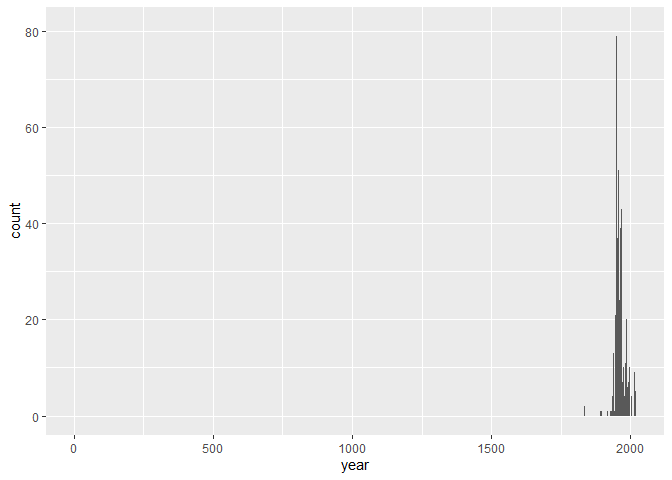
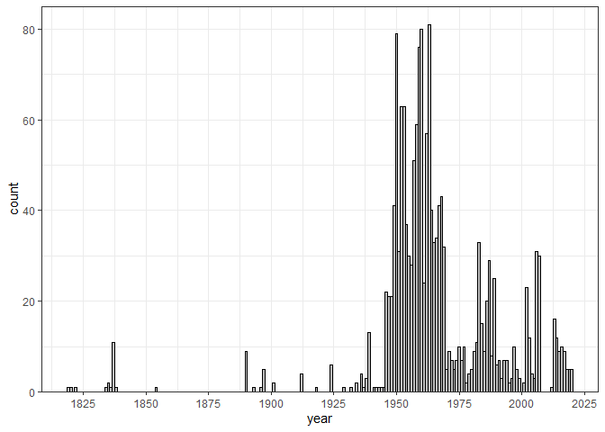

Lab 08 - University of Edinburgh Art Collection
================
Ben Hardin
2/28/2023

### Load packages and data

``` r
library(tidyverse) 
library(skimr)
```

``` r
# Remove eval = FALSE or set it to TRUE once data is ready to be loaded
uoe_art <- read_csv("data/uoe-art.csv")
```

### Exercise 9

Now that we have made the dataframe for the UoE collection, let’s write
some code to make separate columns for title and year in our dataframe!

``` r
uoe_art <- uoe_art %>%
  separate(title, into = c("title", "date"), sep = "\\(") %>%
  mutate(newdate = str_remove(date, "\\Circa")) %>%
  mutate(year = str_remove(newdate, "\\)") %>% as.numeric()) %>%
  select(title, artist, year, link)
```

    ## Warning: Expected 2 pieces. Additional pieces discarded in 39 rows [116, 250,
    ## 370, 410, 453, 533, 572, 679, 740, 808, 852, 886, 1182, 1332, 1354, 1361, 1411,
    ## 1531, 1565, 1592, ...].

    ## Warning: Expected 2 pieces. Missing pieces filled with `NA` in 635 rows [7,
    ## 10, 14, 17, 24, 33, 38, 40, 48, 51, 68, 70, 75, 89, 93, 96, 105, 114, 122,
    ## 130, ...].

    ## Warning in str_remove(newdate, "\\)") %>% as.numeric(): NAs introduced by
    ## coercion

### Exercise 10

We get two errors when we run the code. Both errors happen because R
expects to find 2 pieces (the title and the date), and it’s either
finding more or fewer pieces than that. The first error happens because
its finding that some pieces have an additional parenthetical in the
title besides the date, and its discarding this additional piece. The
second error happens because it’s not finding the date in the title for
some pieces, and so its filling in “NA” for the year for these pieces.

### Exercise 11

Now, if we skim through the dataset we made, we can see that 114 art
pieces have artist info missing (about 4%). 1284 art pieces have year
info missing (about 44%).

``` r
skim(uoe_art)
```

|                                                  |         |
|:-------------------------------------------------|:--------|
| Name                                             | uoe_art |
| Number of rows                                   | 2910    |
| Number of columns                                | 4       |
| \_\_\_\_\_\_\_\_\_\_\_\_\_\_\_\_\_\_\_\_\_\_\_   |         |
| Column type frequency:                           |         |
| character                                        | 3       |
| numeric                                          | 1       |
| \_\_\_\_\_\_\_\_\_\_\_\_\_\_\_\_\_\_\_\_\_\_\_\_ |         |
| Group variables                                  | None    |

Data summary

**Variable type: character**

| skim_variable | n_missing | complete_rate | min | max | empty | n_unique | whitespace |
|:--------------|----------:|--------------:|----:|----:|------:|---------:|-----------:|
| title         |         1 |          1.00 |   0 |  95 |     8 |     1342 |          0 |
| artist        |       114 |          0.96 |   2 |  55 |     0 |     1091 |          0 |
| link          |         0 |          1.00 |  57 |  60 |     0 |     2910 |          0 |

**Variable type: numeric**

| skim_variable | n_missing | complete_rate |    mean |   sd |  p0 |  p25 |  p50 |  p75 | p100 | hist  |
|:--------------|----------:|--------------:|--------:|-----:|----:|-----:|-----:|-----:|-----:|:------|
| year          |      1284 |          0.56 | 1964.02 | 54.9 |   2 | 1953 | 1962 | 1977 | 2020 | ▁▁▁▁▇ |

### Exercise 12

When we try to make a histogram showing the distribution of years for
all the art pieces, we see that there is one extreme outlier, a piece
that seems to date to about the year 0. Further examination shows that
this piece has been given a year of “2” in our dataset.

``` r
ggplot(uoe_art, aes(x = year))+
  geom_histogram(binwidth = 1)
```

    ## Warning: Removed 1284 rows containing non-finite values (`stat_bin()`).

<!-- -->

``` r
#checking this out
uoe_art %>%
  arrange(year)
```

    ## # A tibble: 2,910 × 4
    ##    title                                     artist              year link      
    ##    <chr>                                     <chr>              <dbl> <chr>     
    ##  1 "Death Mask "                             H. Dempshall           2 https://c…
    ##  2 "Sampler. Mary Ann Park "                 Mary Ann Park       1819 https://c…
    ##  3 "Fine lawn collar "                       Unknown             1820 https://c…
    ##  4 "Dying Gaul "                             Unknown             1822 https://c…
    ##  5 "Crouching Venus "                        Sarti               1834 https://c…
    ##  6 "Castor and Pollux "                      Sarti               1835 https://c…
    ##  7 "Gates of Paradise "                      Clement Pappi       1835 https://c…
    ##  8 "Head of Lorenzo de' Medici "             Aristodemo Costoli  1836 https://c…
    ##  9 "Metope 3, south entablature, Parthenon " <NA>                1837 https://c…
    ## 10 "Metope 9, south entablature, Parthenon " <NA>                1837 https://c…
    ## # … with 2,900 more rows

### Exercise 13

So, the problem here is that one piece of art has a parenthetical (2) in
its title, which is being saved as the year by our code. This piece is
“Masks (2)”, and according to its page on the website, it actually dates
to 1964. In order to get the correct date applied to this piece, then,
we have to do some cleaning.

After correcting this one error, we can see that the dates for pieces in
the collection span from the early 1800s to the present, with a majority
of the pieces dating to the 1950s and 60s.

``` r
uoe_art <- uoe_art %>%
  mutate(year = if_else(year == 2, 1964, year))

ggplot(uoe_art, aes(x = year))+
  geom_histogram(binwidth = 1, color = "black", fill = "grey")+
  scale_y_continuous(expand = c(0, 0), limits = c(0, 85))+
  scale_x_continuous(n.breaks = 10)+
  theme_bw()
```

    ## Warning: Removed 1284 rows containing non-finite values (`stat_bin()`).

<!-- -->

### Exercise 14

Let’s find out which artist has the most pieces in the UoE collection!
Technically, “Unknown” has the most pieces, but if we set that aside, we
can see that Emma Gillies has the most pieces in the collection, by
quite a large margin. I was not familiar with her beforehand, but
according to Prof. Google, she was a Scottish potter who attended the
Edinburgh College of Art, and whose work has been exhibited at the UoE
several times.

``` r
uoe_art %>%
  count(artist) %>%
  arrange(desc(n))
```

    ## # A tibble: 1,092 × 2
    ##    artist                   n
    ##    <chr>                <int>
    ##  1 Unknown                344
    ##  2 Emma Gillies           173
    ##  3 <NA>                   114
    ##  4 John Bellany            21
    ##  5 Ann F Ward              19
    ##  6 Boris Bućan             17
    ##  7 Zygmunt Bukowski        17
    ##  8 Marjorie Wallace        16
    ##  9 Gordon Bryce            15
    ## 10 Elizabeth Blackadder    13
    ## # … with 1,082 more rows

### Exercise 15

Lastly, we can filter our dataset to only show the art pieces that
include the word “Child” in the title. There are 11 art pieces in the
UoE collection fitting this criteria.

``` r
uoe_art %>%
  filter(grepl("Child", title))
```

    ## # A tibble: 11 × 4
    ##    title                                                      artist  year link 
    ##    <chr>                                                      <chr>  <dbl> <chr>
    ##  1 "Virgin and Child"                                         Unkno…    NA http…
    ##  2 "Untitled - Children Playing "                             Monik…  1963 http…
    ##  3 "Child's collar. Chinese"                                  Unkno…    NA http…
    ##  4 "Virgin and Child "                                        Unkno…    NA http…
    ##  5 "Figure Composition with Nurse and Child, and Woman with … Edwar…  1950 http…
    ##  6 "Woman with Child and Still Life "                         Cathe…  1938 http…
    ##  7 "The Children's Hour "                                     Eduar…    NA http…
    ##  8 "Virgin and Child "                                        Unkno…    NA http…
    ##  9 "Child's chinese headdress"                                Unkno…    NA http…
    ## 10 "The Sun Dissolves while Man Looks Away from the Unborn C… Eduar…    NA http…
    ## 11 "Untitled - Portrait of a Woman and Child "                Willi…    NA http…
